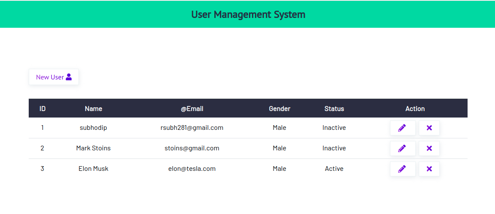

# User Management System app
A User Management System app to manage user and render them dynamically over website


 

- Based on CRUD functionality
- Used Nodejs, Expressjs, MongoDB, Ejs view engine
- Used CSS for UI designing


## Installation

Make sure you have Nodejs and MongoDB installed in your system
- [Nodejs](https://nodejs.org/en/download/)
- [MongoDB](https://www.mongodb.com/docs/manual/installation/)


## Run Locally

Clone the project

```bash
gh repo clone subh-23/User-Management-System
```

Go to the project directory

```bash
  cd my-project
```

Install dependencies

```bash
  npm install
```

Start the server

```bash
  npm start
```


## Environment Variables

To run this project, you will need to add the following environment variables to your .env file

`PORT = 3000`

`MONGO_URI = "mongodb://localhost/userdb"`


## API Reference

#### Get all items

```http
  GET /api/items
```

| Parameter | Type     | Description                |
| :-------- | :------- | :------------------------- |
| `api_key` | `string` | **Required**. Your API key |

#### Get specefic item

```http
  GET /api/items/${id}
```

| Parameter | Type     | Description                       |
| :-------- | :------- | :-------------------------------- |
| `id`      | `string` | **Required**. Id of item to fetch |


#### Post item

```http
  POST /api/items/
```
| Parameter | Type     | Description                |
| :-------- | :------- | :------------------------- |
| `api_key` | `string` | **Required**. Your API key |

#### Update specefic item

```http
  PUT /api/items/${id}
```

| Parameter | Type     | Description                       |
| :-------- | :------- | :-------------------------------- |
| `id`      | `string` | **Required**. Id of item to fetch |

#### Delete item

```http
  DELETE /api/items/${id}
```

| Parameter | Type     | Description                       |
| :-------- | :------- | :-------------------------------- |
| `id`      | `string` | **Required**. Id of item to fetch |


### Deployed over replit as well
- [Link](https://replit.com/@SubhodipRoy1/User-Management-System?v=1)


